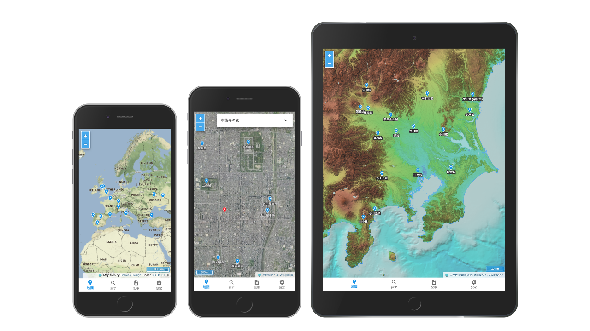

# WikiLayers

**WikiLayers**（ウィキレイヤーズ）はWikipediaから座標を取得し地図で表示するアプリケーションです。  
このアプリケーションはReact, Redux, Material-UIとOpenLayersで作られています。

**WikiLayers** is the Map App which displays Wikipedia Geo Data.  
This App is build by React, Redux, Material-UI, and OpenLayers.

https://cieloazul310.github.io/wikilayers/

### 遊び方

1. 検索フォームに表示したい記事の**タイトル**、または**URL**を入れて検索（「水戸城」「https://ja.wikipedia.org/wiki/偕楽園」など）
2. 記事の座標を取得したら「**地図に追加**」を押す 
3. 「**地図**」を見る

#### How To Play

1. Search a Title or URL you want to get.
  - ex. 'https://en.wikipedia.org/wiki/Wembley_Stadium'
  - I'm sorry, the Title Search is usable only in Japanese.
2. Click the Add to the Map(**地図に追加**) Button.
3. View the Map(**地図**)

#### その他機能

- URLによる検索では多国語に対応しています。
- 記事ページで選択した記事の本文を見ることができます。
- 8種類の**背景地図**が選べます。
- GPSを使った**現在地の表示**ができます。
- スマートフォンでWikiLayersをホーム画面に追加すると、全画面でWikiLayersを起動できます。
- ローカルストレージに情報が保存されるので、アプリを離れても状態は維持されます。
- 設定ページで取得したアイテムから**GeoJSONファイルを出力**することができます。

### 地図の利用について

このアプリケーションはWikimedia Foundationの定める[利用規約]、[ウィキペディアを二次利用する][二次利用]、及び[国土地理院コンテンツ利用規約]に基づき作成されています。
Wikipediaを情報源としている部分においては、[クリエイティブ・コモンズ 表示-継承 3.0 非移植(CC-BY-SA 3.0) ライセンス][CC-BY-SA 3.0]に基づきWikipediaが出典であることを明示して、誰でも自由に利用可能です。

地図画面を二次利用する場合は地図画面右下に表示されている地図の帰属を明記してください。

- 地理院地図
- 写真
- 色別標高図
- 傾斜量図
- 地形スペシャル

また、以上の5つの地図を二次利用する場合は別途[国土地理院コンテンツ利用規約]を参照してください。

WikiLayersの表記については任意とします。

#### 表記例

- 「出典: Wikipedia, 地図: 地理院地図(標準地図) (WikiLayersで表示　URL: https://cieloazul310.github.io/wikilayers/)」
- 「地理院地図, Wikipediaを元に作成」

### 付記

- **Version**: 1.0 (2018/01/29)
- **作成者**: [@cieloazul310]
- **GitHub Repository**: https://github.com/cieloazul310/wikilayers/
- **水戸地図**: https://cieloazul310.github.io

Copyright © 2018 cieloazul310 All right reserved.

[@cieloazul310]: https://twitter.com/cieloazul310
<!-- 
WIKIMEDIA FOUNDATION 利用規約
-->
[利用規約]: https://wikimediafoundation.org/wiki/Terms_of_Use/ja
<!-- 
Wikipedia:ウィキペディアを二次利用する
-->
[二次利用]: https://ja.wikipedia.org/wiki/Wikipedia:%E3%82%A6%E3%82%A3%E3%82%AD%E3%83%9A%E3%83%87%E3%82%A3%E3%82%A2%E3%82%92%E4%BA%8C%E6%AC%A1%E5%88%A9%E7%94%A8%E3%81%99%E3%82%8B
<!--
国土地理院コンテンツ利用規約
-->
[国土地理院コンテンツ利用規約]: http://www.gsi.go.jp/kikakuchousei/kikakuchousei40182.html
<!--
クリエイテブ・コモンズ 3.0
-->
[CC-BY-SA 3.0]: http://creativecommons.org/licenses/by-sa/3.0/
